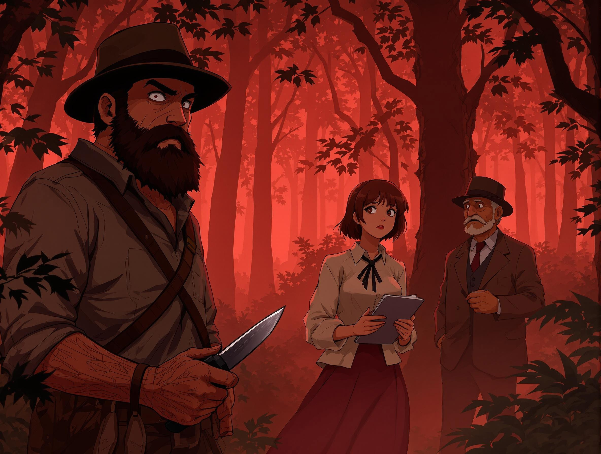
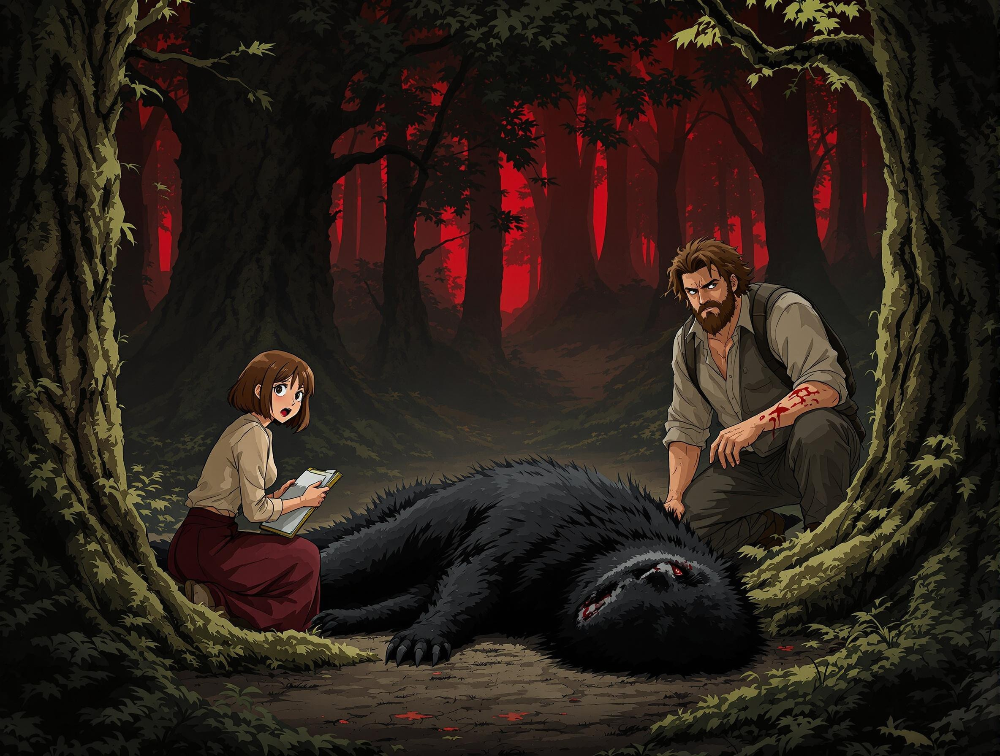

# 
東方異戰錄

---

### 
三國同盟

咖啡館裡瀰漫著濃郁的咖啡香，以及剛出爐麵包的甜膩氣息。五月的陽光溫暖但不刺眼，從落地窗灑進，替略顯昏暗的角落添了幾分明亮。我和羅米莉亞、博格丹，依舊窩在夏洛特咖啡館靠窗的老位置，各自埋首於最新的報紙堆中。

今天的頭版粗黑標題異常醒目：「聯軍攻克亞德里安堡——蘇丹旗幟將永別歐洲！」下方配著模糊的戰壕速寫，油墨氣味濃重。我用指尖摩挲著粗糙的紙面，思緒不禁飄回我們友誼的起點。

「真不敢相信，巴爾幹同盟真的打贏了。」我放下報紙，率先打破了咖啡館裡的寧靜。「土耳其人這次算是栽了個大跟頭。」

博格丹從報紙後探出頭，他總是對軍事新聞格外關注。「哼，鄂圖曼帝國的衰朽是必然，早就該掃進歷史灰燼了。」他的保加利亞口音略顯生硬，語氣卻帶著一絲不易察覺的興奮。

我點點頭，轉向坐在對面的羅米莉亞。「羅米莉亞，我一直想問妳，為什麼羅馬尼亞沒有加入這次的巴爾幹戰爭？我們巴爾幹各民族，不都曾飽受鄂圖曼帝國的壓迫嗎？現在正是我們團結起來，反抗他們暴政的時刻啊。」我的語氣中帶著不解，也隱含著一絲期待。

羅米莉亞放下手中的報紙，她那雙棕色的眼睛總是閃爍著智慧的光芒。「塞爾博斯科，這個問題很複雜，不是一句話能說清楚的。」她輕輕攪動著面前的咖啡，神情沉靜而理性。「妳們可能沒注意到，奧匈帝國的影響力一直都在。奧匈帝國或許暗中希望羅馬尼亞保持中立，以避免局勢更加複雜，維持區域的權力平衡。」

我皺了皺眉，總覺得羅米莉亞的說法過於保守。「難道羅馬尼亞就甘心置身事外嗎？看著我們巴爾幹兄弟浴血奮戰，而無動於衷？」

博格丹也放下報紙，表示贊同我的看法。「是啊，羅馬尼亞的地理位置很重要，如果加入，對巴爾幹同盟絕對是一大助力。」

羅米莉亞輕嘆了口氣。「我知道你們的想法。但是，政治現實往往比理想更複雜。」她停頓了一下，目光中閃過一絲亮光。「或許，我們可以做些什麼，來啟發羅馬尼亞的人民。」

「啟發羅馬尼亞的人民？」我不解地看著她。

「是啊，」羅米莉亞的語氣開始變得興奮起來。「我們可以創辦一份期刊，一份屬於羅馬尼亞人民的期刊。報導巴爾幹戰爭的真相，分析國際局勢，闡述民族團結的重要性，激發人們的愛國熱情，讓更多人認識到，羅馬尼亞不該在這場時代變革中缺席。」

博格丹的眼睛也亮了起來。「這個主意不錯！一份屬於人民的期刊，可以成為重要的發聲管道。」

一股熱流湧上我的心頭，這個想法確實令人振奮。「期刊…期刊…可是，我們要怎麼做？期刊的內容要有哪些？怎麼發行？經費又從哪裡來？」一連串的問題冒了出來。

羅米莉亞笑了笑，她知道我們都已經被這個想法點燃了。「別急，塞爾博斯科。我們慢慢來。首先，要先集思廣益，期刊的定位、內容方向、目標讀者……」

「你還記得嗎？」我突然想起四個月前的薩洛尼卡，「在泛巴爾幹記者會議的晚宴上，我和博格丹為了馬其頓的歸屬問題爭吵得面紅耳赤，民族主義的怒火幾乎要將那張古舊的地圖燒穿。」

博格丹也笑了，鬍鬚微微翹起。「當然記得，當時真恨不得把你丟進薩洛尼卡港。」

「但也是羅米莉亞，」我看向她，感激地笑了笑，「以妳特有的冷靜和洞察力，點醒了我們：當我們沉溺於民族紛爭時，歐洲列強早已將目光投向巴爾幹的經濟利益。」

羅米莉亞聳聳肩，嘴角帶著一絲不易察覺的驕傲。「那晚我們在爭吵、辯論和酒精的作用下，意外地建立起一種奇異的友誼。我們發現，儘管政治立場南轅北轍，但我們都深愛著這片土地，都對新聞事業懷抱熱情，也都對歐洲列強的干預深感不滿。」

博格丹舉起咖啡杯，向我們示意。「為了期刊，為了我們這段不太可能的緣分。」

我和羅米莉亞相視一笑，舉杯相碰，咖啡在杯中晃動，如同我們心中對未來的憧憬，充滿希望，也充滿了未知的挑戰。接下來的討論，變得更加熱烈而充滿幹勁。

陽光依舊穿透咖啡館的窗櫺，灑落在我們三人圍坐的橡木桌面上。昨日激烈的討論彷彿還在空氣中迴盪，但今日，我們的思緒似乎更加清晰，目標也更加明確。羅米莉亞、博格丹和我，這三位來自巴爾幹不同角落的記者，因著對新聞工作的熱情，以及對這片土地複雜政治局勢的共同理解，建立起一份堅固的友誼。

我們的話題，自然而然地延續著昨日的討論。為了那份醞釀中的刊物，我們都渴望找到一個能引起羅馬尼亞民眾共鳴，並能撼動當前政治僵局的主題。

「或許，」羅米莉亞沉吟著，指尖輕輕滑過桌面上那本攤開的《斯特凡大公編年史》，「我們可以從斯特凡大帝的故事開始。」她的眼神明亮而充滿熱情，「想想看，斯特凡大帝是如何以弱擊強，力抗鄂圖曼帝國與波蘭的入侵，捍衛了摩爾多瓦的土地與人民。若我們能將他的事蹟拍成紀錄片，或許能喚醒羅馬尼亞人潛藏的勇氣，進而影響那些宮廷權貴們的決策。」

羅米莉亞的提議，立刻點燃了我心中的火花。斯特凡大帝，這位羅馬尼亞歷史上最偉大的英雄，他的傳奇事蹟，的確是激勵人心的最佳題材。在當前羅馬尼亞於國際局勢中顯得躊躇不前之際，重述斯特凡大帝的故事，或許真能為這個國家注入一股新的活力。

博格丹也表示贊同，他啜飲了一口土耳其咖啡，深邃的目光望向窗外，「我認為，我們可以先去瓦拉幾亞。」他緩緩地說道，「別忘了，當年斯特凡大帝能夠重返王位，瓦拉幾亞的弗拉德三世曾給予他極大的幫助。斯特凡和弗拉德，這兩位都是羅馬尼亞人心中的民族英雄，他們的故事緊密相連，不可分割。」

博格丹的建議，更進一步完善了我們的構想。瓦拉幾亞，這片與摩爾多瓦相鄰的土地，同樣孕育了無數的傳奇故事。若能親身走訪瓦拉幾亞，追尋斯特凡大帝和弗拉德三世的足跡，或許能為我們的紀錄片增添更豐富的歷史縱深與在地視角。

「好，就去瓦拉幾亞！」我當下拍板定案，心中湧起一股難以抑制的興奮。我迫不及待地想要踏上那片古老的土地，親身去感受那些英雄人物曾經的氣息。「我們現在就去車站買票，前往瓦拉幾亞！」

羅米莉亞和博格丹相視一笑，彼此眼中都閃爍著相同的期待與決心。就這樣，在布加勒斯特五月的陽光下，在咖啡館瀰漫的香氣中，我們的英雄紀錄計畫，正式邁出了第一步。而前往瓦拉幾亞的旅程，即將展開。

<i>攝於一九一三年五月・夏洛特咖啡館，布加勒斯特</i>

---

### 
啓程

夜色低垂。前往瓦拉幾亞的列車在鐵軌上規律地晃盪，單調的聲響劃破了寂靜的車廂。煤油燈在頭頂搖曳，將我和羅米莉亞、博格丹的臉龐映照得忽明忽暗。旅途有些疲憊，車廂內除了火車行駛的聲音，就只剩下沉默。為了打破沉悶，我決定先開口，想藉由南斯拉夫的民間傳說開啟話題。

「說到瓦拉幾亞，」我帶著玩笑的語氣問道，「你們聽說過吸血鬼的傳說嗎？說不定我們真能在這裡碰上吸血鬼呢。」

羅米莉亞原本正在筆記本上寫著什麼，聽了我的話，她停下筆，抬起頭。「塞爾博斯科，」她稍微放緩了語氣，嘴角帶著一絲笑意，但眼神依然認真，「弗拉德三世和那些吸血鬼傳說一點關係也沒有喔。」她的語氣帶著一點玩笑的回應，但很快又回到認真的神情，「弗拉德對羅馬尼亞人來說是英雄，是抵抗外敵的偉大君主，不是什麼怪物。」她頓了頓，又帶著半開玩笑的口吻補充說道：「如果你還想當記者的話，就別把這些怪力亂神的東西寫進文章裡，不然...可能主編會直接把你開除吧？」說完，她輕輕笑了笑。

我連忙擺手，笑著說：「放鬆點，羅米莉亞，我只是開個玩笑。」

羅米莉亞輕輕嘆了口氣，帶著一點點無奈的笑了笑，「好好好，吸血鬼就吸血鬼。」她像是敷衍我一般地說著，然後輕輕搖了搖頭，轉頭又看向她的筆記本，「還是來看看斯特凡大公的資料吧，我們正經事還沒開始呢。」她輕聲嘟囔著，鋼筆尖重新落回紙面，似乎暗示著這個玩笑話題就此打住，該回到正軌了。

就在這個時候，列車開始駛入喀爾巴阡山隘。東方的天際泛起了魚肚白，清晨的陽光穿透山巒，灑落在遠方覆蓋著白雪的山峰上，將山頂染成一片蜂蜜般的金色。山腳下，霧氣如同白色面紗般在古老的道路上飄渺，隱約可見牧羊人趕著羊群，緩緩走入迷霧深處。空氣中帶著一絲寒意，卻也預示著新的一天即將到來。喀爾巴阡山脈的清晨，在寂靜中顯得格外莊嚴而神秘。

<video width="100%" src="./media/RHPPKJPRE0FHM7W9XPB64FEC60.mp4" autoplay loop controls muted title="test-title">
就在這個時候，列車開始駛入喀爾巴阡山隘。東方的天際泛起了魚肚白，清晨的陽光穿透山巒，灑落在遠方覆蓋著白雪的山峰上，將山頂染成一片蜂蜜般的金色。山腳下，霧氣如同白色面紗般在古老的道路上飄渺，隱約可見牧羊人趕著羊群，緩緩走入迷霧深處。空氣中帶著一絲寒意，卻也預示著新的一天即將到來。喀爾巴阡山脈的清晨，在寂靜中顯得格外莊嚴而神秘。
</video>

<i>攝於一九一三年五月・喀爾巴阡山隘</i>

---

### 
迷霧森林

抵達瓦拉幾亞的首幾日，我們像真正的紀錄片工作者一樣，埋首於檔案館和圖書館中。古老的羊皮卷、泛黃的文獻，以及歷史學家的低語，構築了我們對弗拉德三世最初的印象。我們走訪了城鎮和鄉村，試圖從當地居民的口中，捕捉更鮮活的歷史片段。布拉索夫、特爾戈維什泰、錫吉什瓦拉……這些名字在歷史書頁中閃爍，也真實地展現在我們眼前。

但很快，我們意識到，真正的故事或許並不在城市喧囂的歷史檔案中，而是在更深遠的地方——在與英雄傳奇緊密相連的土地上，在那些古老的堡壘，以及廣袤的森林之中。羅米莉亞最初對森林探險有些猶豫，她更傾向於城市裡的安全感。 “森林……那裡充滿了未知的危險，塞爾博斯科，” 她皺著眉說道， “而且那些關於弗拉德的傳說，很多都與森林有關，你不覺得……太過陰森了嗎？”

“正是陰森才更真實，羅米莉亞，” 博格丹總是充滿探險精神， “英雄不是活在檔案裡的，他們活在人們的記憶裡，而記憶往往與土地緊密相連。森林，正是孕育傳奇的溫床。”

我贊同博格丹的看法。弗拉德三世，這個被稱為“穿刺公”的英雄，他的傳奇故事與瓦拉幾亞的森林密不可分。那些關於他浴血奮戰的戰場，那些他可能穿梭過的幽暗小徑，才是我們應該去尋找的。 “想想看，羅米莉亞，” 我試圖說服她， “如果我們能在森林中找到一些遺跡，一些與傳說相關的地理線索，那我們的紀錄片將會多麼生動！”

最終，羅米莉亞被我們說服了。或許是記者的好奇心，最終戰勝了她內心的不安。我們決定深入瓦拉幾亞的森林，去探尋那些傳奇戰役的發生地。

為了這次森林探險，我們在當地的村莊僱請了一位嚮導，以及一輛老舊但堅固的馬車。嚮導是一位沉默寡言的老人，臉上佈滿了歲月的皺紋，眼神卻銳利而深邃，彷彿能看穿森林的秘密。馬車裝載著我們的攝影器材和補給品，嘎吱嘎吱地駛向森林的深處。

起初的路還算清晰，但隨著我們逐漸深入，路徑變得越來越模糊。嚮導依賴著口耳相傳的當地傳說，以及他對森林的直覺，帶領我們前進。我們穿梭在茂密的樹林中，陽光被濃密的樹冠遮蔽，只有點點光斑穿透下來，在林地上跳躍。空氣中瀰漫著潮濕的泥土氣息，以及不知名野花的芬芳。

我們開始拍攝，捕捉森林的原始景觀，記錄嚮導口中的傳說故事。我扛著攝影機，興奮地在林間奔走，試圖捕捉每一個值得記錄的瞬間。羅米莉亞雖然還是有些緊張，但也被森林的神秘氣息所吸引，不時提出一些關於當地傳說的問題。我則專注於觀察和記錄，試圖從這些散落的線索中，拼湊出更完整的歷史圖像。

然而，隨著時間的推移，路徑徹底消失了。我們進入了真正的原始森林，腳下只有厚厚的落葉和盤根錯節的樹根。馬車在崎嶇不平的地面上顛簸，發出令人牙酸的聲響。嚮導開始變得不確定起來，他頻頻停下腳步，環顧四周，臉上的皺紋似乎更深了。 “我……我不確定這是否還是正確的路，” 他用不安的語氣說道， “這裡的路……好像不太一樣了。”

他的不安也感染了我們。森林似乎變得越來越幽深，樹木越來越密集，陽光幾乎完全被遮蔽。馬車的輪子開始陷入 ঘন密的灌木叢中，寸步難行。我們下車幫忙推車，但沉重的車身卻像被地面牢牢吸住一般，紋絲不動。

天色漸漸暗淡下來，夕陽的餘暉穿過樹梢，將森林染成一片詭異的橙紅色。我們意識到，我們迷路了。更糟糕的是，森林似乎在移動，在變化，那些參天古樹，那些彎曲的樹枝，彷彿組合成了一張張陌生的面孔，指引著錯誤的方向。指南針失去了作用，森林像一個巨大的迷宮，讓我們徹底失去了方向感。

一層濃厚的霧氣開始從地面升騰，迅速蔓延開來。霧氣吞噬了周圍的景物，能見度驟然降低。森林變得更加寂靜，只有霧氣在樹木間流動的聲音，以及我們略顯粗重的呼吸聲。更令人不安的是，霧氣的顏色，竟然呈現出一種詭異的紅色。那種紅，不是夕陽的餘暉，而是一種更深沉，更不自然的，彷彿染上了鮮血的顏色。

紅霧籠罩下，森林變得如同鬼魅般陰森可怖。羅米莉亞發出了一聲低低的驚呼，緊緊抓住我的手臂。博格丹也停止了拍攝，臉色有些發白。我們都感受到一股難以言喻的壓迫感，彷彿被某種未知的力量所包圍。

就在這時，我們開始聽到一些奇怪的聲音。那聲音來自森林的深處，斷斷續續，忽遠忽近，像是某种动物在靠近……  那声音，低沉而嘶哑，带着一种令人毛骨悚然的野性，在红色的雾气中回荡，仿佛来自另一个世界。

<i>攝於一九一三年五月・瓦拉幾亞森林</i>

---

### 
森林的咆哮

空氣中瀰漫著潮濕的氣息，樹木高聳入雲，遮蔽了大部分的光線，只有零星的光點穿透樹冠，在地面上形成斑駁的光影。自從我們踏入這片紅霧籠罩的區域後，森林似乎變得更加陰森詭譎，時不時會聽到一些難以名狀的聲響，讓人感到不安。

嚮導走在最前面，他是一位沉默寡言的老人，臉上佈滿了歲月的痕跡，眼神中帶著一絲我們難以理解的警惕。他似乎對這片森林有著與生俱來的畏懼，腳步也越來越快，彷彿急於離開這個地方。

突然，一聲震耳欲聾的咆哮劃破了森林的寂靜。那聲音粗獷、野蠻，充滿了原始的獸性，與任何我們所熟悉的動物都截然不同。嚮導如同驚弓之鳥，發出一聲短促的驚呼，便頭也不回地朝來時的方向狂奔而去，轉眼間就消失在濃密的樹林之中。

我們三人頓時停下腳步，環顧四周，試圖尋找聲音的來源。樹叢劇烈地晃動起來，發出沙沙的聲響，彷彿有什麼巨大的東西正在快速逼近。我的心臟開始加速跳動，一股莫名的恐懼感湧上心頭。

就在這時，一個駭人的身影猛然從樹叢中竄出。那是一隻前所未見的野獸，牠的身軀異常巨大，毛髮雜亂而骯髒，如同瀝青般漆黑。牠的眼睛在昏暗的森林中閃爍著嗜血的光芒，獠牙外露，尖銳而猙獰。牠的四肢粗壯有力，每一步都踩得地面震動，發出沉重的聲響。

野獸一出現，就將目標鎖定在了羅米莉亞身上。牠發出又一聲咆哮，朝著羅米莉亞猛撲過去，速度快如閃電。羅米莉亞驚呼一聲，臉色瞬間變得蒼白，本能地向後退去。

千鈞一髮之際，博格丹如同離弦之箭般衝上前去。他發出一聲怒吼，擋在了羅米莉亞的身前，試圖阻擋野獸的攻擊。野獸毫不減速，猛地撞向博格丹！

「呃！」博格丹悶哼一聲，身體像是被重錘擊中般，向後踉蹌幾步。我看到野獸的利爪在他手臂上劃過，衣物瞬間被撕裂，鮮紅的血液立刻滲了出來，滴落在泥土和落葉之上，格外怵目驚心。儘管受了傷，博格丹仍然咬緊牙關，死死地擋在羅米莉亞的前面，沒有絲毫退縮。

看到博格丹手臂上的鮮血，以及羅米莉亞驚恐的表情，我的心頭一緊，再也無法猶豫。我的手迅速摸向腰間，拔出了我隨身攜帶的槍枝。

我快速瞄準野獸的頭部，深吸一口氣，扣下了扳機。「砰！」的一聲槍響，在寂靜的森林中格外刺耳。子彈精準地擊中了野獸的頭部，牠的身體猛地一震，發出一聲痛苦的哀嚎，龐大的身軀轟然倒地，揚起一片塵土。

野獸倒地後，抽搐了几下，便彻底没了动静。森林再次恢复了寂静，只剩下我们三人急促的呼吸声。罗米莉亚脸色苍白，仍惊魂未定，博格丹的额头渗出了汗珠，他按著受傷的手臂，鮮血仍舊從指縫間不斷湧出，但他脸上却带着一丝劫后余生的庆幸。而我，紧握着手中的枪，目光仍然警惕地扫视着周围的树林。

刚才那一幕发生得太快，一切都像是一场突如其来的噩梦。我们三人面面相觑，谁也没有说话，仿佛都还在消化刚才发生的一切。这片森林，果然如同我们预感的那样，充满了未知的危险。我们的纪录片之旅，看来注定不会平静。

<i>攝於一九一三年五月・瓦拉幾亞森林</i>

---