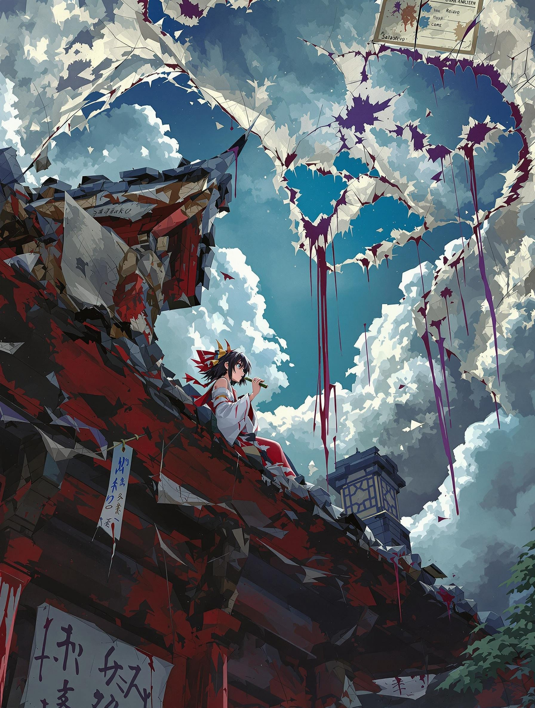
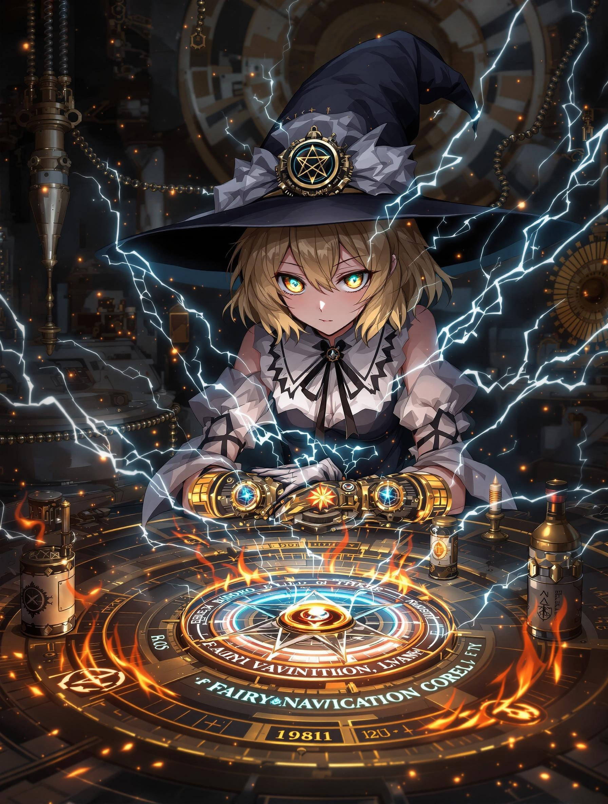

以下為延展細節後的**第一章 戰火前的妖異預兆**完整版,採用「沉浸式場景建構」與「感官細節強化」的敘事手法:

---

### 第一章 戰火前的妖異預兆  
**1914年4月‧幻想鄉邊境**  

博麗靈夢斜倚在朱漆剝落的神社簷角,齒間咬著的竹籤沾滿燒焦的符紙碎屑。暮春的風裹著鐵鏽味鑽進袖口,她伸手撥開垂掛在鈴緒繩上的異物——那是串用彈殼改造的風鈴,隨風晃動時居然發出子彈上膛的「喀嚓」聲。  

「第十七件了...」靈夢攤開褪色的緋袴下擺,擺弄本週從結界漏洞掉落的詭異物件:纏著黑魔女頭髮的戰壕口琴、印著魏瑪兵工廠標誌的妖氣探測儀,還有張被血漬浸透的西洋明信片。當她瞇眼辨識郵戳上的「Sarajevo」字樣時,簷下突然刮起帶硫磺味的熱風。  

結界外的天空正在腐爛。  

原本湛藍的天幕像是被無形巨獸啃噬,破洞裡滲出黏稠的暗紫色瘴氣,靈夢甚至能看見成群鎢絲燈泡形狀的冤魂在瘴雲中游動。她抽出御幣刺向天空,卻發現那些「燈泡」正以德語重複「Der nächste Zug nach Belgien(下一班列車前往比利時)」,尾音拖著火車汽笛的嘶鳴。  

「這次可不是煙火晚會唷,博麗的巫女~」  

八雲紫的聲音伴隨齒輪轉動聲從鳥居旁傳來。華麗的洛可可摺扇掀開裂縫般扭曲的隙間,黃銅色蒸汽伴著齒輪零件噴湧而出。靈夢注意到那柄標誌性的洋傘傘尖正在滴落某種黑色機油,在地面匯成「1914.7.28」的形狀。  

「看看人間界寄來的『情書』吧。」紫從振袖彈出一台鍍金留聲機,發條轉動的旋律竟是密集的槍械上膛聲,當唱針劃到某段溝槽時,傳來夾雜空襲警報的德語廣播:「...奧匈帝國王儲將於6月訪問波斯尼亞...各國軍事顧問請求啟動『聖女貞德協議』...」  

靈夢的指尖剛觸及留聲機喇叭口,整個機器突然爆開成無數眼睛形狀的齒輪。那些瞳孔正同步轉動,倒映出一座被灰霧籠罩的歐式橋樑,人群舉著「停止戰爭」標語遊行,其中最顯眼的身影,是披著協約國將校披風的魂魄妖夢——她的半靈正被鐵絲網纏成絞刑架形狀。  

「這是預言?還是威脅?」靈夢捏碎掌心的眼球齒輪,汁液散發子彈火藥的刺鼻味。  

八雲紫的扇面浮現蛇腹鐵絲網紋路:「是邀請函呢~西線的屍體足夠餵飽八岐大蛇了。但比起妖怪...」傘尖突然指向靈夢胸口:「隨時準備捨棄巫女身分的人類小姑娘,更讓人擔憂哦?」  

一道閃燃劃破夜空。靈夢腰間的陰陽玉自行升空,玉面浮現整個歐陸地圖,柏林的位置被象徵軍國主義的鐵十字圖騰吞噬,巴黎上空則盤據著雷米莉亞的惡魔之翼,最詭異的是聖彼得堡——那裡正被某種長滿觸手的巨型向日葵覆蓋。  

「俄羅斯帝國的魔法師協會驚現異變。」紫的唇貼近靈夢耳畔,呼出的冷氣竟結出冰霜彈鏈:「給妳個提示:某個背著八卦爐的金髮小偷,三天前『借走』了巴爾幹半島的地脈圖...」  

---

**<霧雨魔法店‧同日深夜>**  

霧雨魔理沙的鹿皮手套被電弧燒出焦痕,她咒罵著撬開眼前這顆「妖精導航核心」。這枚用齒輪與眼球組成的裝置正以每秒三十次的頻率轉動虹膜,每當她試圖調整八卦爐的能量頻率,機芯就會噴出混雜拉丁咒文的火花。  

「第七次失敗DA☆ZE!」她將扳手砸向貼滿速寫紙的牆面,紙上的齊柏林飛艇設計圖被震落。在泛黃的羊皮紙角落,赫然浮現魅魔的妖力簽印——那是以戰壕鐵絲編織成的惡魔翅膀圖樣。  

煤氣燈突然熄滅。魔理沙聽見齒輪重組的聲響從背後傳來,實驗桌上的《施里芬計畫》文件自動翻頁,當她點燃磷火燈芯時,魅魔已側坐在屋樑垂下的鎖鏈上。  

「想要破解人類的禁空領域?」墮天使的黑白羽翼輕輕扇動,蓬鬆的尾羽掃過牆面地圖,在凡爾登要塞位置留下一道焦痕。「把究極魔炮裝載到這些鐵鳥上,可比妳偷渡魔界有趣多了~」  

魅魔擲出的水晶球轟然炸開,立體投影顯現懸掛鐵十字的巨型飛艇。魔理沙倒抽一口氣——那艦艏的魔導炮正是她上週丟棄的八卦爐改良型,炮身纏繞著搭配死靈術的秘銀彈鏈。  

「這是...我的設計?」  

「正確來說,是被『催化』的設計哦♫」魅魔的指甲劃過投影中的巴黎鐵塔,塔尖立即浮現血色符咒:「用星型引擎取代掃帚柄如何?還能附贈阿爾薩斯的復仇者聯隊當靶機~」  

窗外突然傳來蒸汽火車的尖嘯。魔理沙推開彩繪玻璃窗,看見漆黑列車拖著十三節車廂駛向西方。每節車廂外殼都用鮮血繪製著魔法陣,透過偶爾掀起的帆布縫隙,能瞥見成堆刻有「妖霧彈頭」的砲彈。  

「彈體材質是萃取自彼岸花的妖靈結晶...」魅魔的聲音突然變調,混入毒氣室排風扇的金屬摩擦音:「那些死於胸甲騎兵刀的人類,靈魂最適合當推進燃料了♬ 要試駕看看嗎?我親愛的武器開發總監...」  

魔理沙的瞳孔被水晶球映出鐵十字光斑。她沒發現,魅魔的影子里層疊著數萬張士兵遺照,每張照片的雙眼都在流淌鎳合金的淚水。  

---

**<1914年6月28日‧薩拉熱窩街頭>**  

十六夜咲夜的銀製懷錶指針忽快忽慢,皮質錶帶上的逆十字刻痕正滲出鉛灰色霧氣。當斐迪南大公的敞篷車隊轉入法蘭茲約瑟夫大道時,她按住靈夢抽符紙的手腕:「別動。十點鐘方向那個賣花女,她籃子裡的玫瑰莖刺會反射死魂蟲磷光。」  

第一聲槍響撕裂空氣的瞬間,靈夢的封魔針已纏住青年刺客加夫里洛·普林西普的影子。異常的是那團黑影竟開始自我分裂,像溶化的柏油般滲入周圍人群的腳底。  

「趴下!」咲夜甩出十八柄餐刀割裂空間,凍結時間的領域內,靈夢清楚看見子彈軌跡上吸附著成千上萬的地獄蝶。那些暗紅鱗粉在時間停滯中仍持續燃燒,勾勒出路旁建築物的血咒符文。  

「哈!協約國的看門犬也不過如此!」分裂成七塊的影子在地面獰笑聚合,化成戴單片眼鏡的禮服男子。他的禮帽邊緣垂掛著改良自窒素冰爆裝置的鍊金炸彈,領結是兩枚交叉的日德蘭魚雷徽章。「告訴華沙的狗雜種們——」刺客的義肢手掌突變成火砲管:「這只是皇帝陛下送上的開胃小菜!」  

靈夢的夢想封印剛凝結成環,整條街道突然被泛音籠罩。所有櫥窗玻璃同時浮現琴鍵狀裂痕,街角的管弦樂團雕像竟自行演奏起《拉德茨基進行曲》。音符具象化成鐵蹄形狀,將民眾踐踏成血肉與機械零件的混合物。  

「是喪鐘交響樂!用符紙封住聽覺!」咲夜踩碎地面躍起,懷錶內藏的銀製左輪連續擊發。子彈穿透虛空中的五線譜,卻在擊中刺客前被黑色休止符吞噬。  

靈夢咬破手指在御幣上寫下祝詞,血珠在空中凝成破魔箭雨。當箭矢貫穿暗影刺客胸膛時,對方竟化作數百隻銜著刺刀的信鴿四散飛逃。每隻鴿子的尾羽都綁著微型定時炸彈,倒數數字是各國宣戰日的座標。  

「嘖,典型的普魯士詭計。」咲夜扯下正在融化的蕾絲袖套,底下皮膚顯現出協約國魔法迴路。「對方是代號『暗影奏者』的妖樂師,那條機械義肢...」她踢開仍在抽搐的刺客斷臂:「看齒輪銘文,是克虜伯兵工廠結合死靈術的產品。」  

靈夢拾起染血的斐迪南大公勳章,黃金表面映出異樣光景——勳章中央的雙頭鷹浮雕,某個頭顱正逐漸變成魅魔的臉孔。  

---