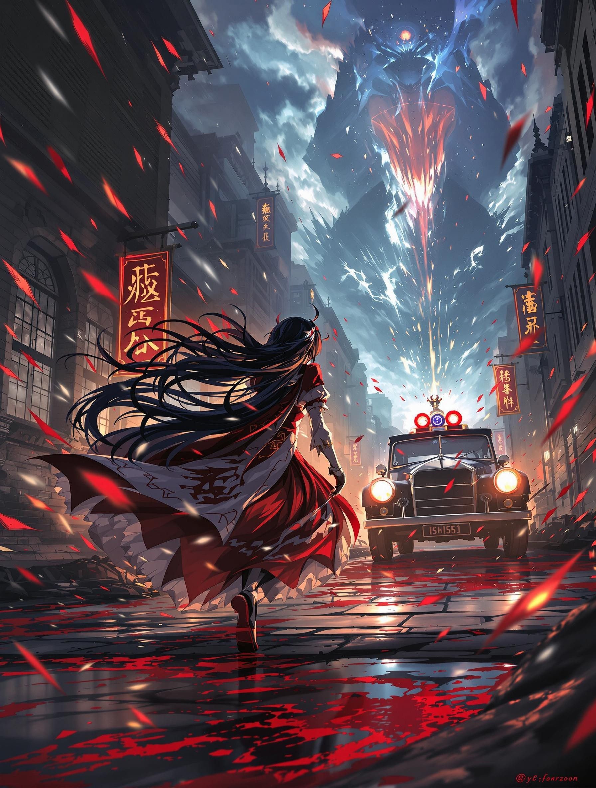

---

### 第一章 戰火前的妖異預兆  
**1914年4月‧幻想鄉邊境**  

博麗靈夢咬著竹籤,趾尖輕點過神社屋簷的風鈴。鈴鐺裡卡著半張染血的西洋明信片,郵戳印著模糊的「Sarajevo」字樣。這是本週第三件從「大結界」漏洞掉進來的怪東西。  

「人間之里那幫傢伙又在搞什麼鬼慶典嗎?」她翻身躍下,緋袴在硫磺味的空氣中劃出焦痕。結界外的天空透著不祥的紫紅色,像是有人把三百張陰陽玉捏碎灑進了雲層。  

「這次可不是祭典唷,小靈夢。」隙間在鳥居旁綻開,八雲紫的洋傘尖正滴落某種機械潤滑油,「是比百鬼夜行更麻煩的東西——」  
紫的袖口滑出一台鍍金留聲機,播放著刺耳的槍械上膛聲與德語廣播:「奧匈帝國王儲即將訪問波斯尼亞......」

---

**<霧雨魔法店‧同日深夜>**  

霧雨魔理沙瞪著實驗桌上碎裂的八卦爐核心,周遭散落著印有鐵十字標誌的設計圖。「這『妖精導航系統』根本是暴殄天物DA☆ZE!」她對著虛空嚷嚷,卻被突然顯現的魅魔按住肩膀。  

「想要突破人類的飛行紀錄嗎?」妖怪賢者的掌心跳出燃燒的設計圖,戰機輪廓中浮現【施里芬計畫】字樣,「把魔炮裝在齊柏林飛艇上,可比盜墓刺激多了。」  

窗外傳來蒸汽機車的轟鳴,載滿符咒彈藥的列車正駛向柏林。魔理沙沒注意到,魅魔的影子裡纏繞著數千條寫滿士兵姓名的死靈鎖鏈。

---

**<1914年6月28日‧薩拉熱窩街頭>**  

咲夜的銀製懷錶停在11點07分。當斐迪南大公的敞篷車轉入法蘭茲約瑟夫大道時,她壓住靈夢拔符紙的手:「刺客身上有地獄蝶的磷粉。看三點鐘方向,戴禮帽的『暗影奏者』。」  

槍響的瞬間,靈夢的封魔針與青年刺客加夫里洛·普林西普的影子同時凝固。那團黑影在霰彈中獰笑分裂,附身到更多旁觀者瞳孔裡。「果然連人類暗殺都是妖怪促成的嗎......」靈夢翻開陰陽玉,卻被混亂的人群撞入血泊。  

八雲紫的聲音穿透硝煙:「看清楚了?這只是『戰爭前菜』,真正的大餐需要你我收拾呢——」

---

**<終幕伏筆>**  

當夜,靈夢在神社倉庫清點「戰利品」:染血的斐迪南大公勳章、半融化的鐵十字軍徽,還有張被死靈附著的團體照。照片裡戴著防毒面具的「人類士兵」身影模糊,唯有角落扛著魔炮的金髮人影清晰可辨——  
那是穿著德軍制服的魔理沙。  

「搞什麼啊......」靈夢把照片扔進火盆,灰燼卻凝成八雲紫的眼眸:「要阻止事態惡化,我們需要借用美利堅的『某位風祝』力量唷~」  

此時,巴黎地下鐵的某節車廂內,蕾米莉亞正舔拭紅酒杯沿的血漬:「人類的戰爭遊戲?那就讓夜戰變得更華麗吧~咲夜,準備好時停爆破裝置了嗎?」  

---
